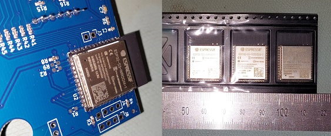
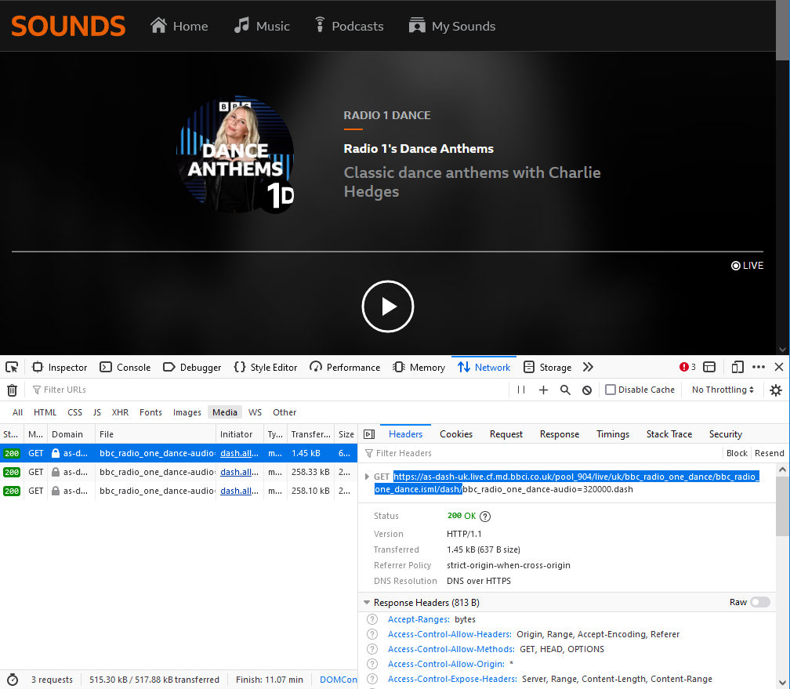

# MPEG-DASH HTTP File Server for ESP32

**Based on the [Simple HTTP File Server Example](https://github.com/espressif/esp-idf/blob/master/examples/protocols/http_server/file_serving/README.md)**

This code example has been modified to allow hosting MPEG-DASH (.mpd) files in a manner supported by internet radios. Specifically, it was designed to allow local hosting of .mpd files which allow BBC Radio 1 Dance and BBC Radio 1 Relax to be listened to on an internet radio as the BBC have decided to make these streams "BBC Sounds exclusive" and forbid internet radio providers from including them in their databases. A .mpd file contains instructions for connecting to the BBC servers and playing an MPEG-DASH stream; this server does not receive and process audio itself.

It's worth checking [here](https://gist.github.com/bpsib/67089b959e4fa898af69fea59ad74bc3) before buying any hardware in case officially-hosted .mpd file links are discovered in the future. At this time, only HLS links are known, which are not supported by many internet radios.

This project makes two modifications to the original example which are *required* for Frontier internet radios to work with the files:

* Sets content-type header to application/dash+xml for files with a .mpd extension
* Sets content-length header with length of the file

This code should work on any model of ESP32, but it was tested on an ESP32-S3.

Convenient breakout boards with USB ports are available cheaply from various sources.

# Setup

This project requires the ESP-IDF framework to be installed. Once done, a few simple commands from the ESP-IDF Command Line are required to configure the project.

Use [idf.py set-target](https://docs.espressif.com/projects/esp-idf/en/latest/esp32/api-guides/tools/idf-py.html#select-the-target-chip-set-target) to set the chip to whichever one you are using (e.g. ESP32S3) - do this first as it will clear all subsequent settings such as WiFI passwords.

Use idf.py menuconfig to open up the configuration tool. Go down to 'Example Connection Configuration' in the list, press Enter, then enter your WiFI connection parameters, then press Q to quit.

Connect an ESP32 board to the computer and use Device Manager to check which COM port has been assigned to it. Run idf.py build flash monitor -p COMx to build and flash the project, and to open a serial terminal. This will allow you to easily see whether the WiFi connection was successful and what IP address has been assigned.

If the build is successful and the WiFi configuration is correct, the board should connect to your access point. Open your router configuration and set the device to use a static IP address.

Type the IP address into a web browser and you'll see the 'ESP32 File Server' page. Use the controls in the top right corner to upload your .mpd files and they'll appear in the list. All you have to do now is add each URL from the table to your MPEG-DASH supporting internet radio as a custom URL (e.g. http://192.168.4.12/bbc_radio_one_dance_hq.mpd) and it should just work!

# .mpd files

Two example .mpd files are included which work at the time of writing. Should the BBC change the links or add new "BBC Sounds Exclusive" stations in the future, use the instructions below to get the new stream URLs.

The BBC DASH links can be obtained by opening BBC Sounds in a web browser, pressing F12 to open developer tools, going to the Network tab, applying the Media filter, then starting the desired live radio stream. Copy the .dash link that appears except for the last part, change 'https' to 'http', then it should work if you put the link in the templates provided.

